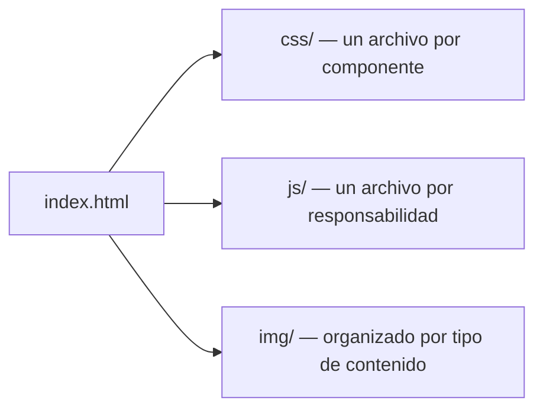

<div align="center">

# 🏡 Hogar Canitas Felices

**Sitio web corporativo para un hogar geriátrico — cuidado, calidez y confianza.**

[]()
[]()
[]()
[]()

</div>

---

## 📖 Descripción

**Hogar Canitas Felices** es el sitio web corporativo oficial de un hogar geriátrico, diseñado para transmitir tranquilidad, confianza, profesionalismo y calidez humana a las familias que buscan un lugar de cuidado para sus seres queridos.

El proyecto se desarrolla de forma **incremental por sprints**: comienza como un sitio estático en HTML5/CSS3/JavaScript, y evolucionará hacia una plataforma completa con **Angular**, un **backend aún por definir** (candidatos: Spring Boot o Python/Flask — ver `docs/ARCHITECTURE.md`) y un **panel administrativo (CMS)** que permitirá al personal del hogar geriátrico gestionar su propio contenido sin depender de un desarrollador.

> 📚 La visión completa del proyecto vive en [`docs/PROJECT.md`](docs/PROJECT.md).

---

## 🛠️ Tecnologías

### Estado actual (sitio estático)

| Categoría | Tecnología |
|---|---|
| Estructura | HTML5 semántico |
| Estilos | CSS3 (Flexbox, Grid, variables CSS) — sin frameworks CSS |
| Comportamiento | JavaScript ES6 (vanilla, sin dependencias) |
| Tipografía | Google Fonts — [Fraunces](https://fonts.google.com/specimen/Fraunces) + [Plus Jakarta Sans](https://fonts.google.com/specimen/Plus+Jakarta+Sans) |
| Iconografía | SVG propios, sin librerías de terceros |

### Objetivo (plataforma completa)

| Categoría | Tecnología |
|---|---|
| Frontend | Angular + TypeScript |
| Backend | **Por definir** — candidatos: Spring Boot (Java) o Python (Flask u otro). Decisión formal por ADR en el Sprint 6 |
| Base de datos | Motor relacional (PostgreSQL/MySQL — a definir por ADR) |
| Autenticación | Spring Security + JWT |
| Contenerización | Docker + Docker Compose |
| Despliegue | Nube (proveedor a definir por ADR) |

> El detalle completo de ambas eras tecnológicas vive en [`docs/ARCHITECTURE.md`](docs/ARCHITECTURE.md).

---

## 🏗️ Arquitectura

El proyecto sigue una arquitectura de **responsabilidad única por archivo**: cada componente visual tiene su propio archivo CSS y, si tiene comportamiento, su propio archivo JavaScript. Ningún estilo ni script vive embebido en el HTML.



Esta separación no es solo estética: está pensada para que la futura migración a Angular sea una **traducción estructurada** de componentes ya validados, no un rediseño desde cero.

> Arquitectura completa, diagramas y decisiones técnicas en [`docs/ARCHITECTURE.md`](docs/ARCHITECTURE.md) y [`docs/ADR.md`](docs/ADR.md).

---

## 📂 Estructura del proyecto

```
CanitasFelices/
├── CLAUDE.md                 # Instrucciones permanentes de desarrollo
├── README.md                 # Este archivo
├── index.html                # Página de inicio
├── favicon.ico
│
├── docs/                     # Documentación técnica y funcional completa
│   ├── PROJECT.md
│   ├── ARCHITECTURE.md
│   ├── DESIGN_SYSTEM.md
│   ├── ROADMAP.md
│   ├── CONTRIBUTING.md
│   ├── CHANGELOG.md
│   ├── ADR.md
│   └── NFR.md
│
├── css/                      # Un archivo por componente visual
│   ├── styles.css            # Design tokens, reset, tipografía base
│   ├── navbar.css
│   ├── banner.css
│   ├── cards.css
│   ├── gallery.css
│   ├── contact.css
│   ├── footer.css
│   ├── animations.css
│   └── responsive.css
│
├── js/                       # Un archivo por responsabilidad
│   ├── navbar.js
│   ├── gallery.js
│   ├── whatsapp.js
│   ├── animations.js
│   └── app.js
│
└── img/
    ├── banner/
    ├── logo/
    ├── iconos/
    ├── servicios/
    ├── sedes/
    │   ├── la-pampa/
    │   └── campestre/
    └── testimonios/
```

---

## 🚀 Instalación y ejecución

### Requisitos

- Un navegador moderno (Chrome, Firefox, Edge o Safari actualizados).
- Opcional: un servidor local simple para desarrollo (no es obligatorio — el sitio funciona abriendo `index.html` directamente).

### Opción 1 — Abrir directamente

1. Clona o descarga el proyecto, **manteniendo la estructura de carpetas intacta** (especialmente `css/` y `js/` — un error común es que se renombren o queden en otra ubicación relativa al `index.html`).
2. Abre `index.html` con doble clic o arrastrándolo a tu navegador.

### Opción 2 — Servidor local (recomendado para desarrollo)

Usar un servidor local evita comportamientos inconsistentes de rutas relativas entre navegadores:

```bash
# Con Python 3
python3 -m http.server 8080

# Con Node.js (usando el paquete serve)
npx serve .
```

Luego visita `http://localhost:8080` en tu navegador.

> ⚠️ Si al abrir el sitio no ves colores, tipografía ni el layout esperado (solo texto plano con viñetas), casi siempre es un problema de ruta: verifica que la carpeta se llame exactamente `css` (no `ccs` u otra variante) y que esté al mismo nivel que `index.html`.

---

## 🗺️ Roadmap

| Sprint | Nombre | Estado |
|---|---|---|
| 1 | Home estático | ✅ Completado |
| 2 | Documentación técnica y funcional | ✅ Completado |
| 3 | Funcionalidades JavaScript e interactividad | ✅ Completado |
| 4 | Páginas internas del sitio estático | ✅ Completado |
| 5 | Contenido real, formulario e integraciones | ⏳ Planificado |
| 6 | Preparación de la migración | ⏳ Planificado |
| 7 | Migración a Angular | ⏳ Planificado |
| 8 | Backend (framework a definir) y CMS inicial | ⏳ Planificado |
| 9 | Integración, calidad y lanzamiento | ⏳ Planificado |

> Detalle completo de cada sprint (objetivos, entregables, criterios de aceptación) en [`docs/ROADMAP.md`](docs/ROADMAP.md).

---

## 📸 Capturas de pantalla

> *Pendiente — se agregarán capturas reales del sitio en producción durante el Sprint 5, una vez el contenido y las imágenes definitivas reemplacen a las imágenes de referencia actuales.*

| Home (Desktop) | Home (Mobile) |
|---|---|
| `[captura pendiente]` | `[captura pendiente]` |

| Galería por sede | Formulario de contacto |
|---|---|
| `[captura pendiente]` | `[captura pendiente]` |

---

## 📄 Documentación completa

| Documento | Contenido |
|---|---|
| [`docs/PROJECT.md`](docs/PROJECT.md) | Visión, objetivos, alcance y definición de éxito |
| [`docs/ARCHITECTURE.md`](docs/ARCHITECTURE.md) | Arquitectura técnica completa, actual y objetivo |
| [`docs/DESIGN_SYSTEM.md`](docs/DESIGN_SYSTEM.md) | Identidad visual, tokens y componentes |
| [`docs/ROADMAP.md`](docs/ROADMAP.md) | Planificación detallada de los 9 sprints |
| [`CLAUDE.md`](CLAUDE.md) | Instrucciones permanentes de desarrollo |
| [`docs/CONTRIBUTING.md`](docs/CONTRIBUTING.md) | Guía de contribución y flujo de Git |
| [`docs/CHANGELOG.md`](docs/CHANGELOG.md) | Historial de cambios (Keep a Changelog) |
| [`docs/ADR.md`](docs/ADR.md) | Registro de decisiones de arquitectura |
| [`docs/NFR.md`](docs/NFR.md) | Requisitos no funcionales y métricas de calidad |

---

## 📜 Licencia

Proyecto de carácter **privado/propietario**, desarrollado específicamente para Hogar Canitas Felices. Todos los derechos reservados. No se distribuye bajo una licencia de código abierto.

> Si en el futuro se decide liberar partes del proyecto (por ejemplo, el sistema de diseño) bajo una licencia abierta, esa decisión debe registrarse como ADR antes de aplicarse.

---

## 🙌 Créditos

- **Desarrollo y documentación técnica**: construido de forma incremental con asistencia de Claude (Anthropic), bajo dirección y revisión humana en cada sprint.
- **Tipografías**: [Fraunces](https://fonts.google.com/specimen/Fraunces) y [Plus Jakarta Sans](https://fonts.google.com/specimen/Plus+Jakarta+Sans), vía Google Fonts.
- **Iconografía y logotipo**: diseño original en SVG, creado específicamente para este proyecto.

---

<div align="center">

*Documentación mantenida como fuente de verdad del proyecto — ver [`CLAUDE.md`](CLAUDE.md) para las reglas de actualización.*

</div>
