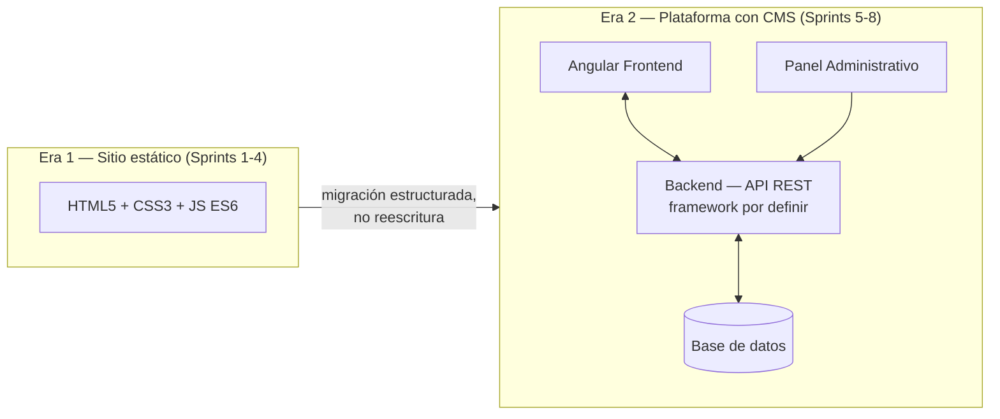
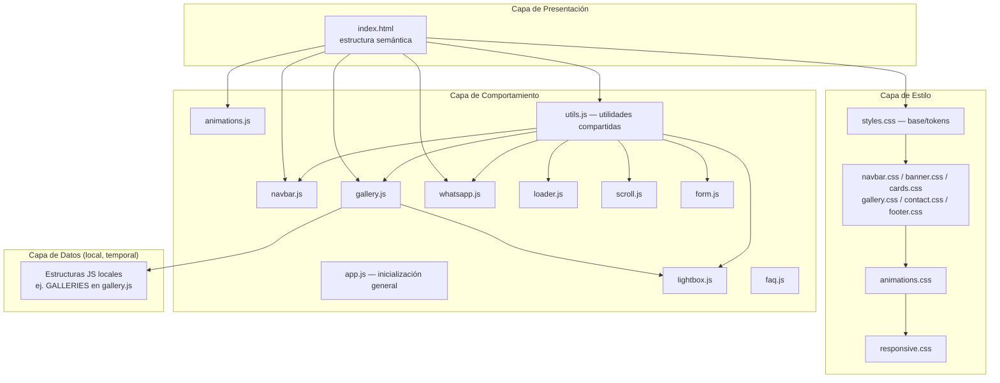
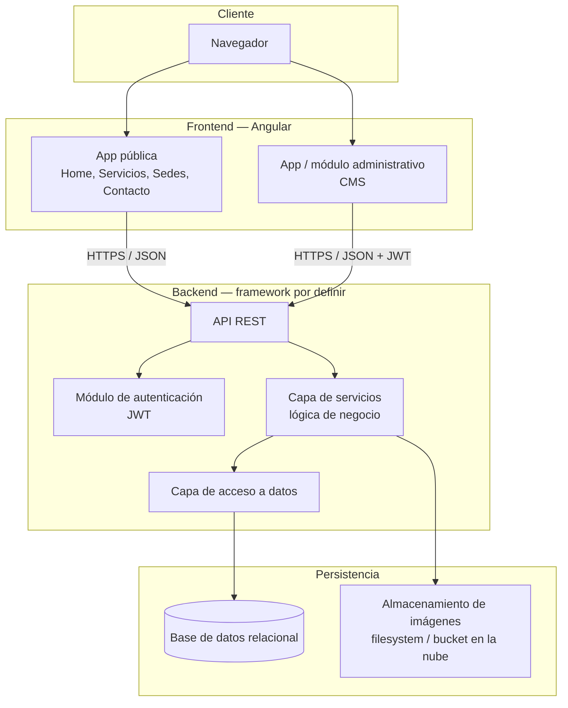
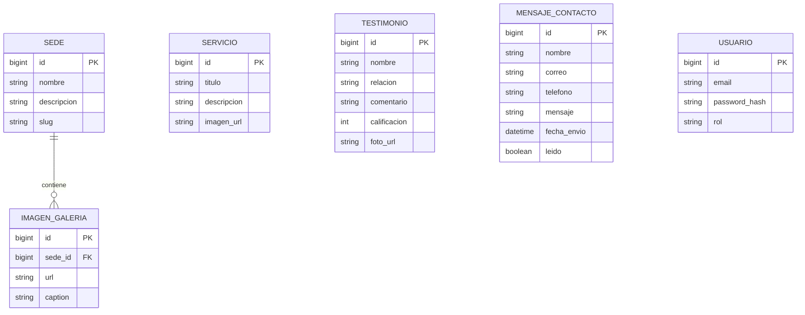

# ARCHITECTURE.md — Hogar Canitas Felices

> Documento de arquitectura técnica. Define **cómo** está construido el sistema hoy y **cómo** debe evolucionar. Toda implementación debe ser consistente con lo aquí descrito. Cualquier desviación debe registrarse primero como ADR (ver `ADR.md`) antes de implementarse.

---

## 1. Visión arquitectónica general

Hogar Canitas Felices se construye en dos grandes eras arquitectónicas, diseñadas desde el inicio para que la segunda no requiera descartar la primera:



La premisa arquitectónica central es: **el frontend estático de la Era 1 no es un prototipo desechable — es la especificación viva de los componentes que Angular implementará**. Por eso la separación de responsabilidades (un componente = un archivo CSS + un archivo JS), la nomenclatura BEM y la ausencia de frameworks CSS no son preferencias estéticas: son decisiones que reducen la distancia entre "maqueta" y "componente Angular".

---

## 2. Arquitectura actual (Era 1 — sitio estático)

### 2.1 Diagrama de capas



### 2.2 Principio de responsabilidad única por archivo

Cada archivo CSS y JS tiene **una única responsabilidad**, sin excepciones:

| Archivo | Responsabilidad única |
|---|---|
| `css/styles.css` | Design tokens (variables), reset, tipografía base, utilidades globales compartidas (incluye botones flotantes: WhatsApp, scroll-to-top) |
| `css/navbar.css` | Apariencia y estados de la navbar, incluido el indicador de sección activa |
| `css/banner.css` | Hero / banner de pantalla completa |
| `css/cards.css` | Las 4 familias de tarjetas del sitio (why, service, location, testimonial) |
| `css/gallery.css` | Tabs y grid de la galería |
| `css/contact.css` | Formulario de contacto (incluidos estados de carga/error) y placeholder de mapa |
| `css/footer.css` | Pie de página |
| `css/animations.css` | Sistema de animaciones de scroll (`data-animate`, variantes, duración/delay personalizados) |
| `css/loader.css` | Pantalla de carga inicial |
| `css/lightbox.css` | Modal de galería a pantalla completa |
| `css/faq.css` | Acordeón de preguntas frecuentes (en uso en el Home desde el ajuste post-Sprint 3) |
| `css/page-header.css` | Encabezado compartido de páginas internas (breadcrumb + título) — Sprint 4 |
| `css/nosotros.css` | Estilos específicos de `nosotros.html` (historia, CTA) — reutiliza `.why-card`/`.why__grid` para valores y misión/visión |
| `css/content-blocks.css` | Bloque imagen+texto reutilizable (`.media-text`), compartido por `nosotros.html` y `servicios.html` |
| `css/responsive.css` | Ajustes por breakpoint (se carga al final, siempre sobreescribe) |
| `js/utils.js` | Utilidades compartidas sin conocimiento de ningún componente (debounce, throttle, lock de scroll, focus trap) |
| `js/loader.js` | Pantalla de carga inicial |
| `js/navbar.js` | Estado de scroll de la navbar, menú móvil, indicador de sección activa, scroll accesible |
| `js/scroll.js` | Botón flotante "volver arriba" |
| `js/lightbox.js` | Modal de galería (apertura/cierre, navegación, zoom, swipe, precarga) |
| `js/gallery.js` | Datos y renderizado de la galería por sede, integración con el lightbox |
| `js/whatsapp.js` | Configuración centralizada, tooltip, visibilidad y tracking del botón flotante de WhatsApp |
| `js/animations.js` | Observador de scroll para animaciones de entrada |
| `js/form.js` | Formulario de contacto: validación, estados de carga/éxito/error, envío real vía Web3Forms a contacto@hogarcanitasfelices.com |
| `js/faq.js` | Acordeón de preguntas frecuentes (en uso en el Home desde el ajuste post-Sprint 3) |
| `js/app.js` | Inicialización general que no pertenece a ningún componente (hoy: solo el año dinámico del footer) |

Esta tabla es la referencia oficial: **antes de agregar código a un archivo existente, se debe verificar que corresponda a su responsabilidad declarada aquí.** Si no corresponde, se crea un archivo nuevo (como ya ocurrió con `contact.css`, que no estaba en la arquitectura original del Sprint 1 y se agregó explícitamente en vez de mezclarse con `styles.css`).

### 2.3 Estructura de carpetas actual

```
CanitasFelices/
├── CLAUDE.md
├── README.md
├── index.html
├── nosotros.html               # Sprint 4 — páginas internas
├── servicios.html
├── favicon.ico
├── docs/                      # Documentación técnica y funcional (este set de documentos)
├── css/
│   ├── styles.css
│   ├── navbar.css
│   ├── banner.css
│   ├── cards.css
│   ├── gallery.css
│   ├── contact.css
│   ├── footer.css
│   ├── animations.css
│   ├── loader.css
│   ├── lightbox.css
│   ├── faq.css                # En uso en index.html (sección #faq)
│   ├── page-header.css        # Sprint 4 — encabezado compartido de páginas internas
│   ├── content-blocks.css     # Sprint 4 — bloque imagen+texto compartido
│   ├── nosotros.css           # Sprint 4 — específico de nosotros.html
│   └── responsive.css
├── js/
│   ├── utils.js                # Se carga primero: los demás módulos dependen de él
│   ├── loader.js
│   ├── navbar.js
│   ├── scroll.js
│   ├── lightbox.js
│   ├── gallery.js
│   ├── whatsapp.js
│   ├── animations.js
│   ├── form.js
│   ├── faq.js                  # En uso en index.html (sección #faq)
│   └── app.js
├── img/
│   ├── banner/
│   ├── logo/
│   ├── iconos/
│   ├── servicios/
│   ├── sedes/
│   │   ├── la-pampa/
│   │   └── campestre/
│   └── testimonios/
└── fonts/                     # Reservado; actualmente se usa Google Fonts vía <link>
```

### 2.4 Patrones de diseño aplicados (Era 1)

- **Module Pattern (IIFE)**: cada archivo JS se envuelve en una función autoejecutable (`(function () { 'use strict'; ... })();`) para no contaminar el scope global — es el equivalente funcional más cercano a un módulo Angular sin usar un bundler.
- **Namespace global único para comunicación entre módulos** (`window.CanitasFelices`, ver ADR-011): como el proyecto no usa `import`/`export` (ADR-004), los módulos que necesitan ser consumidos por otros (`utils.js`, `lightbox.js`, `form.js`, `faq.js`) exponen su API pública bajo este único objeto global, en vez de introducir variables globales sueltas por archivo.
- **Observer Pattern**: `IntersectionObserver` en `animations.js`, `whatsapp.js`, `scroll.js` y `navbar.js` (scrollspy) para reaccionar a cambios de visibilidad sin acoplar la lógica al evento `scroll` directamente.
- **Single Source of Truth local**: `gallery.js` centraliza los datos de galería en un único objeto (`GALLERIES`), de forma que el "reemplazo por una API REST" en la Era 2 sea un cambio de origen de datos, no de lógica de renderizado.
- **Progressive Enhancement**: el sitio es funcional (contenido legible, formulario enviable de forma nativa, enlaces de WhatsApp funcionales) incluso si JavaScript falla parcialmente; las mejoras interactivas se agregan encima, no reemplazan la base. Ejemplo reforzado en este sprint: los 4 enlaces de WhatsApp conservan un `href` funcional en el HTML aunque `whatsapp.js` no llegue a ejecutarse.
- **Fail-safe defaults**: los scripts verifican la existencia de elementos del DOM antes de operar sobre ellos (`if (!navbar || !toggle || !menu) return;`), y proveen *fallbacks* (ej. `animations.js` y `scroll.js` muestran/habilitan todo si no hay soporte de `IntersectionObserver`).
- **Accesibilidad de foco programático**: al desplazar la vista mediante JavaScript (navegación de la navbar, scroll-to-top), el foco de teclado se mueve explícitamente al destino (`tabindex="-1"` temporal + `focus()`), no solo la vista — patrón introducido en este sprint y reutilizado consistentemente en `navbar.js` y `scroll.js`.

### 2.5 Convenciones de nombres (Era 1)

| Elemento | Convención | Ejemplo |
|---|---|---|
| Clases CSS | BEM (`bloque__elemento--modificador`) | `.service-card__title`, `.gallery__tab.is-active` |
| Estados | Prefijo `is-` / `has-` | `.is-active`, `.is-invalid`, `.is-visible` |
| Archivos CSS/JS | kebab-case, nombre = componente | `navbar.css`, `gallery.js` |
| IDs de HTML | camelCase | `contactForm`, `whatsappFloat` |
| Atributos `data-*` | kebab-case, describen intención | `data-animate="fade-up"`, `data-location="la-pampa"` |
| Variables CSS | kebab-case con prefijo semántico | `--color-sky`, `--space-md`, `--fs-lg` |
| Funciones JS | camelCase, verbo + sustantivo | `renderGallery()`, `setActiveTab()`, `validateField()` |

Estas convenciones **no son negociables dentro de un sprint**; un cambio de convención requiere un ADR (ver `ADR.md`) porque afecta la previsibilidad del código en todos los archivos existentes.

---

## 3. Arquitectura objetivo (Era 2 — Angular + backend por definir)

> **Estado de la decisión**: el framework de backend **no está decidido todavía**. Se evalúan al menos dos alternativas — Spring Boot (Java) y Python (con Flask u otro framework equivalente) — y la elección formal se registrará como ADR antes del inicio del Sprint 6 (ver `docs/ROADMAP.md`, Sprint 6). Lo descrito en esta sección son los **principios arquitectónicos que debe cumplir el backend, sin importar cuál se elija** — capas, contrato REST, autenticación — no una implementación específica de Spring Boot.

### 3.1 Diagrama de arquitectura objetivo



### 3.2 Frontend objetivo (Angular)

- **Arquitectura por *feature modules***: cada sección del sitio (Home, Servicios, Sedes, Galería, Contacto) se convierte en un módulo/feature independiente, reflejando la separación por componente ya existente en CSS/JS.
- **Componentes standalone o modulares** (según la versión LTS de Angular vigente al momento de la migración — decisión a formalizar en ADR durante el Sprint 6): un componente Angular por cada "tarjeta"/bloque ya identificado (`WhyCardComponent`, `ServiceCardComponent`, `LocationCardComponent`, `TestimonialCardComponent`, `GalleryComponent`, `ContactFormComponent`).
- **Servicios Angular (`@Injectable`)** reemplazan las estructuras de datos locales de `gallery.js`, consumiendo la API REST vía `HttpClient`.
- **Mapeo directo de nomenclatura**: las clases BEM actuales se convierten en la base de los *selectors* y clases de los componentes Angular, minimizando la reinterpretación de diseño.
- **Módulo administrativo separado** (lazy-loaded), con su propio *routing* protegido por `AuthGuard`, para no cargar lógica de CMS en el sitio público.

### 3.3 Backend objetivo (framework por definir)

Independientemente del framework que se elija, el backend debe cumplir estos principios — son requisitos de arquitectura, no características exclusivas de un framework:

- **Arquitectura en capas clásica**: Controlador/Endpoint → Servicio → Acceso a datos → Modelo, con separación estricta de responsabilidades.
- **API REST versionada** (`/api/v1/...`) para no romper al frontend público durante futuras evoluciones del panel administrativo.
- **DTOs/schemas explícitos** entre capas (nunca exponer el modelo de datos interno directamente en las respuestas de la API) — decisión que se formalizará como ADR durante el Sprint 8.
- **Autenticación basada en JWT** para proteger exclusivamente los endpoints del panel administrativo; los endpoints de lectura pública (servicios, sedes, galería, testimonios) permanecen sin autenticación.
- **Validación de entrada en el servidor** (no solo en el cliente) en todos los formularios (ej. contacto), replicando en backend las reglas ya implementadas en `app.js` — el mecanismo concreto depende del framework elegido (Bean Validation en Spring Boot, Marshmallow/Pydantic en Python, u otro equivalente).

**Alternativas en evaluación** (a decidir formalmente en el ADR del Sprint 6):

| Criterio | Spring Boot (Java) | Python (Flask u otro) |
|---|---|---|
| Madurez para APIs REST enterprise | Alta, ecosistema muy establecido | Alta, con curva más ligera de arranque |
| Afinidad con el stack ya elegido (Angular/TypeScript) | Neutra (stacks distintos, integración estándar por API REST) | Neutra (misma consideración) |
| Curva de aprendizaje para quien mantenga el proyecto | Mayor (tipado estricto, más *boilerplate*) | Menor (más directo para equipos pequeños) |
| Ecosistema de seguridad (JWT, roles) | Muy maduro (Spring Security) | Maduro, mayor variedad de librerías a evaluar caso a caso |
| Alineación con "preparación para Docker/nube" (`docs/PROJECT.md`) | Buena (imágenes JRE estándar) | Buena (imágenes ligeras, arranque rápido) |

> Esta tabla es un punto de partida para la discusión del Sprint 6, no una recomendación — la decisión final debe considerar también la experiencia real del equipo que mantendrá el proyecto a largo plazo, criterio que pesa tanto como los técnicos.

### 3.4 Base de datos objetivo

- Motor relacional (PostgreSQL o MySQL — decisión formal pendiente de ADR en Sprint 6).
- Entidades previstas iniciales: `Servicio`, `Sede`, `ImagenGaleria`, `Testimonio`, `MensajeContacto`, `Usuario` (para el panel administrativo).
- Migraciones versionadas (Flyway o Liquibase — decisión pendiente de ADR) desde el primer *sprint* de backend, para evitar cambios de esquema no rastreados.



> Este modelo es preliminar y orientativo — se formalizará (con tipos de datos definitivos, índices y restricciones) como parte del entregable del Sprint 6, no como parte de este documento de arquitectura general.

### 3.5 API REST — contrato previsto (alto nivel)

| Recurso | Método | Endpoint | Autenticación |
|---|---|---|---|
| Servicios | GET | `/api/v1/servicios` | Pública |
| Sedes | GET | `/api/v1/sedes` | Pública |
| Galería por sede | GET | `/api/v1/sedes/{slug}/galeria` | Pública |
| Testimonios | GET | `/api/v1/testimonios` | Pública |
| Mensaje de contacto | POST | `/api/v1/contacto` | Pública (con validación + rate limiting) |
| Servicios (CRUD) | POST/PUT/DELETE | `/api/v1/admin/servicios` | Requerida (JWT) |
| Sedes (CRUD) | POST/PUT/DELETE | `/api/v1/admin/sedes` | Requerida (JWT) |
| Mensajes recibidos | GET | `/api/v1/admin/contacto` | Requerida (JWT) |
| Autenticación | POST | `/api/v1/auth/login` | Pública (emite JWT) |

> Este contrato es una previsión de alto nivel para guiar el diseño del frontend y backend en paralelo durante el Sprint 6. El contrato definitivo (con *schemas* de request/response) se documentará como especificación OpenAPI en el sprint correspondiente.

### 3.6 Autenticación y autorización

- **JWT (JSON Web Tokens)** para el panel administrativo, emitidos por `/api/v1/auth/login`.
- Roles previstos inicialmente: `ADMIN` (acceso completo) y `EDITOR` (gestión de contenido, sin gestión de usuarios) — a confirmar alcance exacto antes del Sprint 8.
- El sitio público **nunca** requiere autenticación; es contenido abierto por diseño.
- Los tokens se almacenan en el cliente Angular siguiendo las prácticas recomendadas vigentes al momento de la implementación (a definir en ADR de Sprint 8, considerando el trade-off entre `localStorage` y cookies `httpOnly`).

---

## 4. Estructura de carpetas objetivo (Era 2, referencial)

```
canitas-felices/
├── frontend/                       # Aplicación Angular
│   ├── src/
│   │   ├── app/
│   │   │   ├── core/                # Servicios singleton, guards, interceptores
│   │   │   ├── shared/              # Componentes, pipes y directivas reutilizables
│   │   │   ├── features/
│   │   │   │   ├── home/
│   │   │   │   ├── servicios/
│   │   │   │   ├── sedes/
│   │   │   │   ├── galeria/
│   │   │   │   ├── contacto/
│   │   │   │   └── admin/           # Módulo administrativo (lazy-loaded)
│   │   │   └── app.routes.ts
│   │   └── assets/
│   └── ...
├── backend/                         # Aplicación de backend (framework a definir en Sprint 6)
│   │
│   │   # Si se elige Spring Boot (Java):
│   ├── src/main/java/com/canitasfelices/
│   │   ├── controller/
│   │   ├── service/
│   │   ├── repository/
│   │   ├── entity/
│   │   ├── dto/
│   │   ├── security/
│   │   └── config/
│   │   # (estructura equivalente en capas si se elige Python/Flask u otro:
│   │   #  routes/ o controllers/, services/, repositories/ o models/,
│   │   #  schemas/, auth/, config/ — mismos principios de la sección 3.3)
│   └── ...
├── docs/                            # Documentación técnica (se mantiene desde la Era 1)
└── docker-compose.yml               # Orquestación local frontend + backend + base de datos
```

> Esta estructura es **referencial** para guiar decisiones tempranas del Sprint 6 en adelante; se formalizará con su propio ADR al iniciar la migración, no se implementa durante la Era 1. La ruta exacta de `backend/` dependerá del framework elegido, pero **debe conservar la misma separación por capas** descrita en la sección 3.3, sin importar cuál se seleccione.

---

## 5. Preparación para Docker y despliegue en la nube

- **Docker**: cada capa (frontend, backend, base de datos) se contenerizará de forma independiente, orquestada con `docker-compose` en entornos de desarrollo/staging.
- **Multi-stage builds** previstos para el frontend Angular (build de producción servido por Nginx) y para el backend (imagen base ligera y específica del runtime del framework elegido — ej. JRE si es Spring Boot, o una imagen `python:slim` si es Python — nunca una imagen de desarrollo completa en producción).
- **Variables de entorno** para toda configuración sensible o dependiente de entorno (credenciales de base de datos, URLs de API, secretos JWT) — nunca hardcodeadas en el código, desde el primer sprint de backend.
- **Despliegue en la nube**: proveedor específico (AWS, GCP o Azure) pendiente de decisión formal vía ADR durante el Sprint 9, en función de presupuesto y familiaridad del equipo que dé mantenimiento al proyecto.

---

## 6. Escalabilidad

- La separación por capas y la ausencia de acoplamiento entre frontend y "fuente de datos" (ver 2.4, Single Source of Truth local) permiten escalar el backend de forma independiente del frontend.
- El diseño de la API REST versionada (`/api/v1/...`) permite introducir cambios futuros sin romper clientes existentes.
- La arquitectura modular de Angular (*feature modules* + *lazy loading*) permite que el crecimiento del panel administrativo no incremente el tamaño del bundle del sitio público.
- El modelo de datos relacional previsto admite normalización estándar sin necesidad de migrar a una arquitectura de microservicios en el corto/mediano plazo — decisión consciente para no sobre-diseñar (ver `PROJECT.md`, principio "preparar sin sobre-construir").

---

## 7. Buenas prácticas transversales (ambas eras)

- Ningún archivo mezcla responsabilidades de estructura (HTML), estilo (CSS) y comportamiento (JS) — principio ya aplicado en la Era 1 y que se traduce directamente a la separación *template / style / logic* de los componentes Angular.
- Todo componente visual nuevo debe evaluarse contra la tabla de responsabilidad única (sección 2.2) antes de decidir en qué archivo vive.
- Toda nueva dependencia externa (librería, framework, servicio de terceros) debe justificarse y registrarse como ADR antes de incorporarse.
- La documentación (`ARCHITECTURE.md`, `ADR.md`, `DESIGN_SYSTEM.md`) se actualiza en el mismo sprint en que ocurre un cambio estructural — nunca de forma retroactiva y desconectada del desarrollo real.

---

*Fin de ARCHITECTURE.md.*
